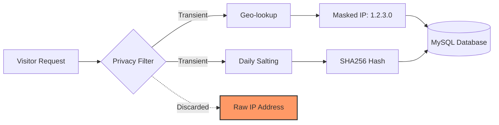

# View Counter

[](https://harshankur.github.io/viewcounter/)
[](LICENSE)
[](TEST_REPORT.md)

A comprehensive Node.js/Express analytics server for tracking website views with MySQL storage, featuring auto-database creation, advanced tracking, and rich analytics.

## 📖 Documentation
Visit our [Interactive Documentation](https://harshankur.github.io/viewcounter/) for detailed API specifications, debugging tips, and integration guides.

## 🛡️ GDPR Compliant & Privacy-First
**100% GDPR Compliant By Design.** This project is built from the ground up to respect user privacy and adhere to modern ethical standards:
- **Zero Cookies**: No cookies, no local storage, and no consent banners required.
- **Data Sovereignty**: You own your data. Analytics never leave your private infrastructure.
- **Minimal Collection**: Tracks only what is necessary (Country, Browser, OS, Page Path).

### 🔄 Data Privacy Lifecycle


### 🧬 What happens to the IP?
We believe in total transparency regarding your visitors' data:
1. **Transient Use Only**: The raw IP address is used only in memory for the initial Country lookup and for generating the daily unique visitor hash.
2. **Immediate Masking**: Before being saved to disk, the IP is masked (IPv4 last octet is zeroed).
3. **No Storage**: The raw, identifiable IP address **never** touches the database disk.
4. **Automated Guards**: Our build pipeline includes fail-safe regex tests to ensure no code changes can accidentally start saving raw IPs.

## ✨ Features

### Core Capabilities
- 🔒 **Security**: Prepared statements, rate limiting, Helmet.js, input validation
- ⚡ **Performance**: Connection pooling with mysql2, duplicate prevention
- 🗄️ **Flexible Database**: Connect to existing DB or auto-create schema
- 🛠️ **Easy Setup**: Interactive CLI wizard with config detection
- 🏥 **Production-Ready**: Health checks, graceful shutdown, structured logging

### Advanced Tracking
- 📍 **Page Tracking**: Track specific pages/paths, not just app-level
- 🔗 **Referrer Analysis**: Automatic source categorization (search, social, email, campaign, referral, direct)
- 🖥️ **User Agent Parsing**: Browser, OS, and device type detection
- 👤 **Session Tracking**: Group views by user session
- 🎯 **Custom Events**: Track button clicks, form submissions, etc.
- 📊 **Time-Based Analytics**: Hourly, daily, and weekly trends

## Quick Start

### 1. Install Dependencies
```bash
npm install
```

### 2. Run Setup Wizard
```bash
npm run setup
```

The wizard will:
- Detect existing configuration (if any)
- Guide you through database setup (connect vs. create mode)
- Configure allowed app IDs and device sizes
- Optionally create `.env` file

### 3. Start Server
```bash
npm start
```

## Configuration

### Database Modes

**Connect Mode** (default): Use existing database
```json
// dbInfo.json
{
    "mode": "connect",
    "host": "127.0.0.1",
    "database": "viewcounterdb",
    "user": "root",
    "password": "your_password"
}
```

**Create Mode**: Auto-create database and tables
```json
// dbInfo.json
{
    "mode": "create",
    "host": "127.0.0.1",
    "database": "viewcounterdb",
    "user": "root",
    "password": "your_password"
}
```

### Allowed Values
```json
// allowed.json
{
    "appId": ["blog", "portfolio"],
    "deviceSize": ["small", "medium", "large"]
}
```

### Environment Variables (optional)
See `.env.example` for all options. Key settings:
- `DB_MODE`: `connect` or `create`
- `PORT`: Server port (default: 3030)
- `RATE_LIMIT_MAX`: Max requests per minute (default: 100)
- `UNIQUE_VISITOR_WINDOW_HOURS`: Duplicate prevention window (default: 24, 0 to disable)

## API Endpoints

### 📊 Tracking

#### Register View (Enhanced)
```bash
# Basic (backward compatible)
GET /registerView?appId=blog&deviceSize=medium

# Enhanced with page tracking
GET /registerView?appId=blog&deviceSize=medium&page=/blog/my-post&title=My%20Post

# With referrer and session
GET /registerView?appId=blog&deviceSize=medium&page=/blog/my-post&referrer=https://google.com&sessionId=abc123
```

**Automatic tracking:**
- ✅ IP address and geolocation
- ✅ Browser, OS, device type (from User-Agent)
- ✅ Referrer domain and source type
- ✅ Duplicate prevention (configurable window)

**Response**: 
```json
{"message": "Success!", "duplicate": false}
```

#### Track Custom Event
```bash
POST /event
Content-Type: application/json

{
  "appId": "blog",
  "eventType": "button_click",
  "eventData": {"button": "subscribe", "location": "header"},
  "sessionId": "abc123",
  "page": "/blog/my-post"
}
```

### 📈 Analytics

#### Get Statistics
```bash
GET /stats/:appId
```
**Response**:
```json
{
  "appId": "blog",
  "stats": {
    "total": 1523,
    "uniqueVisitors": 892,
    "last24Hours": 47,
    "byCountry": [{"country": "US", "count": 423}],
    "byDevice": [{"devicesize": "medium", "count": 789}]
  }
}
```

#### Get Trends
```bash
# Daily trends for last 30 days
GET /trends/:appId?period=daily&days=30

# Hourly trends for last 7 days
GET /trends/:appId?period=hourly&days=7

# Weekly trends for last 12 weeks
GET /trends/:appId?period=weekly&days=84
```

**Response**:
```json
{
  "appId": "blog",
  "period": "daily",
  "days": 30,
  "trends": [
    {"period": "2026-01-01", "count": 45},
    {"period": "2026-01-02", "count": 52}
  ]
}
```

#### Get Referrer Statistics
```bash
GET /referrers/:appId?limit=20
```

**Response**:
```json
{
  "appId": "blog",
  "bySource": [
    {"source_type": "search", "count": 450},
    {"source_type": "social", "count": 230},
    {"source_type": "direct", "count": 180}
  ],
  "byDomain": [
    {"referrer_domain": "google.com", "count": 320},
    {"referrer_domain": "twitter.com", "count": 150}
  ]
}
```

#### Get Browser/OS Statistics
```bash
GET /browsers/:appId
```

**Response**:
```json
{
  "appId": "blog",
  "byBrowser": [
    {"browser": "Chrome", "count": 650},
    {"browser": "Safari", "count": 320}
  ],
  "byOS": [
    {"os": "Windows", "count": 550},
    {"os": "Mac OS", "count": 380}
  ],
  "byDeviceType": [
    {"device_type": "desktop", "count": 890},
    {"device_type": "mobile", "count": 450}
  ]
}
```

#### Get Page Statistics
```bash
GET /pages/:appId?limit=20
```

**Response**:
```json
{
  "appId": "blog",
  "pages": [
    {"page_path": "/blog/post-1", "page_title": "My First Post", "views": 234},
    {"page_path": "/blog/post-2", "page_title": "Second Post", "views": 189}
  ]
}
```

#### Get Session Details
```bash
GET /sessions/:appId/:sessionId
```

**Response**:
```json
{
  "appId": "blog",
  "sessionId": "abc123",
  "events": [
    {
      "id": 1,
      "event_type": "pageview",
      "page_path": "/blog/post-1",
      "timestamp": "2026-01-09T21:30:00.000Z"
    },
    {
      "id": 2,
      "event_type": "button_click",
      "event_data": {"button": "subscribe"},
      "timestamp": "2026-01-09T21:31:15.000Z"
    }
  ],
  "count": 2
}
```

#### Get Recent Views
```bash
GET /views/:appId?limit=10&offset=0
```

#### List Apps
```bash
GET /apps
```

#### Health Check
```bash
GET /health
```

#### Test IP Detection
```bash
GET /ip
```

## Deployment

### Production with nohup
```bash
nohup node index.js > stdout.log &
# Kill with: kill <pid>
```

### Environment Variables
Set `NODE_ENV=production` to hide error details in API responses.

## What Gets Tracked?

For each view/event, the system automatically captures:

| Field | Source | Description |
|-------|--------|-------------|
| **IP Address** | Request | Visitor IP |
| **Country** | GeoIP lookup | 2-letter country code |
| **Timestamp** | Server | When the event occurred |
| **Device Size** | Query param | small, medium, large |
| **Page Path** | Query param (optional) | e.g., `/blog/my-post` |
| **Page Title** | Query param (optional) | e.g., "My Blog Post" |
| **Referrer** | Header/query (optional) | Full referrer URL |
| **Referrer Domain** | Parsed | e.g., `google.com` |
| **Source Type** | Parsed | search, social, email, campaign, referral, direct |
| **Browser** | User-Agent | e.g., Chrome, Safari, Firefox |
| **Browser Version** | User-Agent | e.g., 120.0 |
| **OS** | User-Agent | e.g., Windows, Mac OS, Linux |
| **OS Version** | User-Agent | e.g., 10, 14.2 |
| **Device Type** | User-Agent | desktop, mobile, tablet, tv, console |
| **Session ID** | Query param (optional) | Group events by session |
| **Event Type** | Query param/body | pageview, click, submit, etc. |
| **Event Data** | Body (optional) | Custom JSON data |

## Understanding `UNIQUE_VISITOR_WINDOW_HOURS`

This setting prevents counting the same visitor multiple times within a time window.

**How it works:**
- When a view is registered, the system checks if the same IP has visited within the last X hours
- If yes: Returns `{duplicate: true}` (doesn't count again)
- If no: Inserts new view

**Examples:**
- `24` (default): Same IP counts as 1 view per day
- `0`: Disable duplicate prevention (count every request)
- `168`: Same IP counts as 1 view per week

**Note:** Only applies to `pageview` events, not custom events.

### 🛡️ Privacy Guardrails (Fail-Safe)
To guarantee that raw IPs never leak into the database, we've implemented an automated **Privacy Guard** suite ([privacyFailSafe.test.js](file:///Users/harshankur/Desktop/codes/viewcounter/tests/privacyFailSafe.test.js)):
- **Query Interception**: Every single SQL `INSERT` is intercepted during tests.
- **Regex Scanning**: We scan all query parameters against raw IP patterns (IPv4 and IPv6).
- **Hard Enforcement**: If the system ever attempts to save an unmasked IP, the test suite immediately fails, preventing accidental privacy regressions.

This makes ViewCounter not just "Privacy-First" by design, but **Privacy-Guaranteed** by automation.

- [x] Implement IP masking utility
- [x] Implement transient hashing for uniqueness
- [x] Update `DatabaseManager` to use hashes/masked IPs
- [x] Update `db/schema.sql` (column renaming/clarification)
- [x] Remove "IP Address" references from docs/README
- [x] Update documentation with "How it works" privacy section
- [x] Update and verify tests

## Security Features

- ✅ SQL injection prevention (prepared statements)
- ✅ Rate limiting (100 req/min default)
- ✅ Security headers (Helmet.js)
- ✅ Input validation (express-validator)
- ✅ IP validation
- ✅ Duplicate view prevention

## Client-Side Integration

### Basic Tracking
```html
<script>
  // Track page view
  fetch('https://your-server.com/registerView?appId=blog&deviceSize=medium');
</script>
```

### Enhanced Tracking
```javascript
// Generate session ID (store in sessionStorage)
const sessionId = sessionStorage.getItem('sessionId') || 
  Math.random().toString(36).substring(2);
sessionStorage.setItem('sessionId', sessionId);

// Track page view with full context
fetch(`https://your-server.com/registerView?` + new URLSearchParams({
  appId: 'blog',
  deviceSize: window.innerWidth < 768 ? 'small' : 
               window.innerWidth < 1200 ? 'medium' : 'large',
  page: window.location.pathname,
  title: document.title,
  referrer: document.referrer,
  sessionId: sessionId
}));
```

### Track Custom Events
```javascript
async function trackEvent(eventType, eventData) {
  await fetch('https://your-server.com/event', {
    method: 'POST',
    headers: {'Content-Type': 'application/json'},
    body: JSON.stringify({
      appId: 'blog',
      eventType,
      eventData,
      sessionId: sessionStorage.getItem('sessionId'),
      page: window.location.pathname
    })
  });
}

// Track button click
document.querySelector('#subscribe-btn').addEventListener('click', () => {
  trackEvent('button_click', {button: 'subscribe', location: 'header'});
});
```

## Testing

### Running Tests

```bash
# Run all tests with coverage (auto-generates TEST_REPORT.md)
npm test

# Run tests in watch mode (for development)
npm run test:watch

# Run tests and persist database for inspection
npm run test:persist

# Run tests for CI/CD (no report generation)
npm run test:ci
```

### Test Database

**Automatic Management:**
- ✅ Creates fresh `viewcounterdb_test` database before each test run
- ✅ Populates with realistic test data
- ✅ Automatically cleaned up after tests complete

**Persist Database for Debugging:**
```bash
# Keep test database after tests
npm run test:persist

# Or set environment variable
PERSIST_TEST_DB=true npm test
```

When persisted, you can inspect the database:
```sql
USE viewcounterdb_test;
SHOW TABLES;
SELECT * FROM test_app_1;
```

To manually remove:
```sql
DROP DATABASE viewcounterdb_test;
```

### Test Reports

**Automatically generated after every test run:**
- ✅ **Terminal output**: Immediate test results and coverage
- ✅ **TEST_REPORT.md**: Comprehensive markdown summary (auto-generated)
- ✅ **test-report.html**: Visual test results with dark theme
- ✅ **coverage/index.html**: Interactive code coverage report

All reports are created in the project root directory.

### Test Coverage

The test suite includes:

#### Unit Tests
- ✅ **UserAgentParser**: Browser, OS, and device detection
- ✅ **ReferrerParser**: Traffic source categorization

#### Integration Tests
- ✅ **Health Check**: Server status monitoring
- ✅ **View Registration**: Basic and enhanced tracking
- ✅ **Custom Events**: Event tracking with metadata
- ✅ **Statistics**: Aggregated analytics
- ✅ **Trends**: Time-based analytics
- ✅ **Referrers**: Traffic source analysis
- ✅ **Browsers**: Browser/OS/device breakdown
- ✅ **Pages**: Page view statistics
- ✅ **Sessions**: Session journey tracking
- ✅ **Rate Limiting**: Request throttling

### Test Scenarios

All endpoints are tested with:
- ✓ Valid inputs
- ✓ Invalid inputs
- ✓ Missing parameters
- ✓ Edge cases
- ✓ Security validation

## License

[MIT](LICENSE) - Do whatever you want with this, just don't sue us.